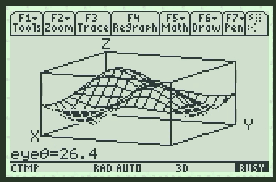
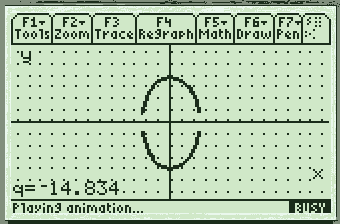
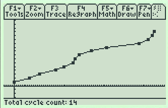

# AMS++
NOTE: a lot of stuff in this repo is currently unfinished, but progress is being made. Refer to [TODO.md](TODO.md)

This is a collection of programs written in Motorola 68K assembly\*, C, and TI-BASIC that significantly extend the capabilities of the TI-89 Titanium. Here is a list of the programs in this package and their capabilities:

 * [**CycleGen/CycleView:**](ccg_and_ccv) Generate and play back monochrome animations of graphs
 * [**Clicker:**](clicker) An interactive recursive function executor
 * [**Quickzoom/Spinner:**](quickzoom_and_spinner) Some highly intuitive programs that make it easier to navigate various 2D and 3D graphs
 * [**Battery Cycle Tracker:**](battcycl) A small BASIC utility that allows you to track and visualize the cycling of your calculator's rechargeable batteries. Can also be used to visualize how often you throw away and replace alkaline batteries
   - Environmental Notice: Please use rechargeable NiMH batteries in your TI-68Ks whenever you can, as they are rather power-hungry calcs
 * [**dord:**](dord) Gets the ordinal date of a certain day - i.e., the *n*th day of a year for a given date
 * [**idbd:**](idbd) Gets the number of days between two ISO 8601-formatted dates
 * [**padstr:**](padstr) A convenient, powerful little string utility that pads and truncates strings

They can most likely be ported to other platforms with little effort, however that has not been done yet as the author of most of these programs does not have a TI-92 [Plus]/Voyage 200.

---

*: 99.9% of the handwritten assembly wasn't written by me - I am simply incorporating others' work into my own to produce better programs, while of course obeying the limitations and requirements of the licenses that code is distributed under. (Sometimes a legal gray area comes up, but I have some justification and/or special written permission for each case.)
