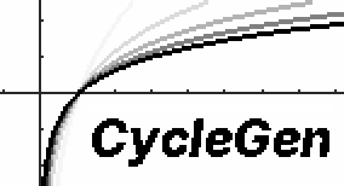

CycleGen is the most powerful graphical animation generator for the TI-89 Titanium. Supports 2D, 3D, parametric, polar, sequence, and differential graphs. It can easily take full advantage of all available memory. See [README_CYCLEGEN.txt](README_CYCLEGEN.txt) for information on how to use it.

This program is bundled with CycleView, an intuitive, lightweight animation player designed for use with CycleGen. It features conveniences the OS's built-in CyclePic instruction lacks. See [README_CYCLEVIEW.txt](README_CYCLEVIEW.txt) for information on how to use it.

---

### The story behind the logo

The original graphs in the logo above were created with CycleGen on a physical TI-89 Titanium. The function is `log(x,q)` where the `x`-axis is the argument and `q` is a variable that ranges from 1.44 to 3 in steps of 0.39. There are five frames in total. They were played with CycleView and transferred onto a computer with an early version of [Titanium-49](https://github.com/ardent-development/Titanium-49/tree/6f9378f642d1616658067404d4832b5593017af4). Each frame was then cropped and layered on top of the previous one with a progressively heavier opacity in [Inkscape](https://inkscape.org/). A PNG version of the faded graphs was then loaded up in [GIMP](https://www.gimp.org/), and the "CycleGen" text was added. Then, in [jspaint.app](https://jspaint.app), it was scaled up by a factor of 4.

The reason this log function in particular was used is that [the author](https://github.com/twisted-nematic57) almost always used it to test the program during development. And the reason why they always used it during development... is that CycleGen development began around the time when they were learning about logarithms in Mr. C's Precalculus class.

**This logo is FOSSception:** The screenshots were fetched from the calculator using Titanium-49 (the author of CycleGen also wrote that and is quite proud), only FOSS software was used to edit the logo itself, and [the font](https://rsms.me/inter/) is also open-source.
